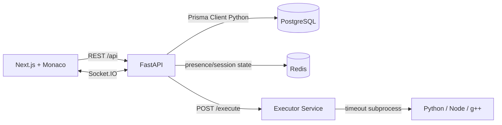
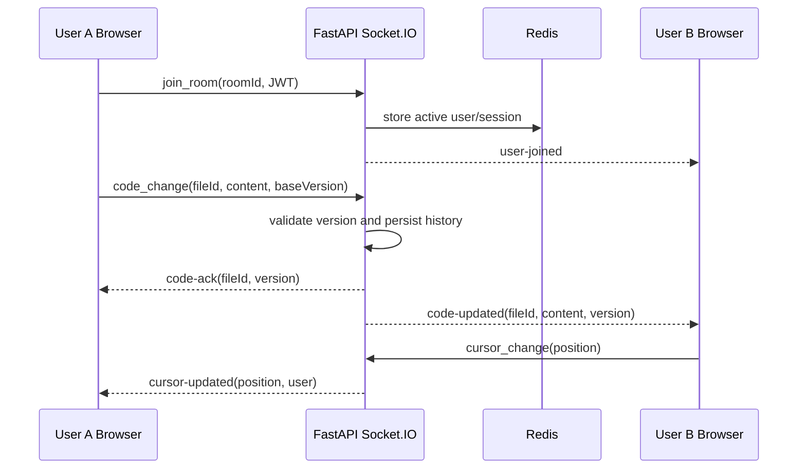
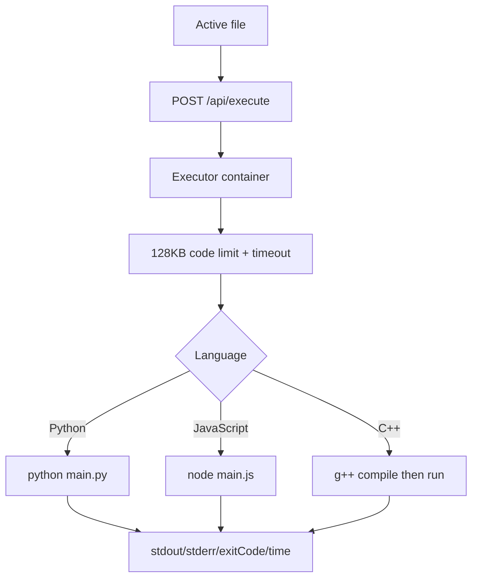
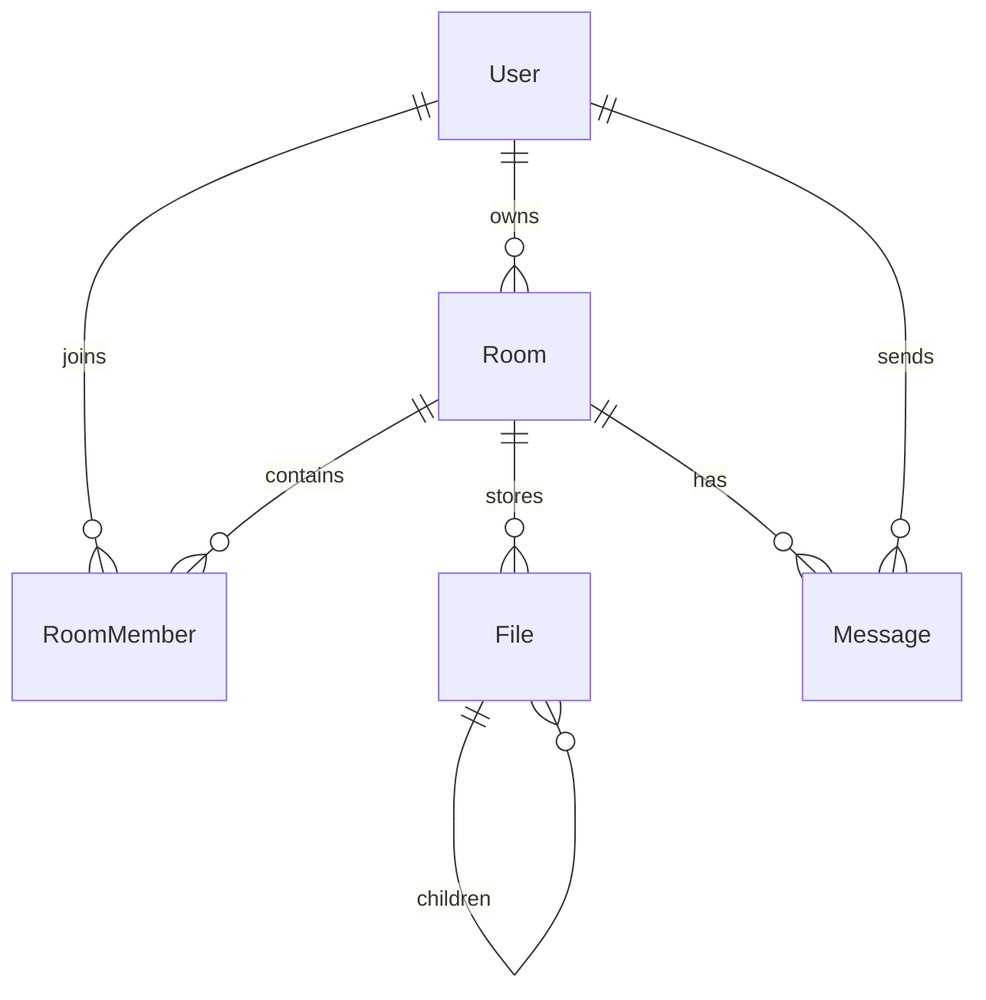

# Collab Code Editor

A production-style real-time collaborative code editor built with Next.js, FastAPI, Socket.IO, Monaco Editor, PostgreSQL, Redis, Prisma, Docker, and a sandboxed execution service.

## Features

- JWT signup/login with bcrypt password hashing
- Protected room dashboard and profile pages
- Create, join, delete, and invite to rooms by room ID
- Monaco-based collaborative editor with tabs and language modes
- Realtime code synchronization over Socket.IO
- Version-aware collaboration with conflict detection and file version history
- Live presence, cursor movement events, typing indicators, and reconnect recovery
- Visual remote cursor decorations inside Monaco Editor
- File explorer with nested file/folder model, create/delete/rename, and autosave
- IDE-style explorer with folder picker import, drag/drop import, context menu, tabs, and local save-back where the browser supports File System Access
- Room chat with persisted messages
- Redis-backed room presence and socket session tracking
- PostgreSQL persistence through Prisma schema and generated Python client
- Sandboxed code execution service for Python, JavaScript, and C++
- Execution input/output limits, timeout, resource caps, and basic dangerous-pattern rejection
- Docker Compose local environment
- API, auth, and executor tests

## Architecture



## WebSocket Flow



## Execution Pipeline



## Database Relationships



## Tech Stack

- Frontend: Next.js App Router, JavaScript, TailwindCSS, Monaco Editor, Zustand, Axios
- Backend: FastAPI, python-socketio, Prisma Client Python, JWT, bcrypt
- Data: PostgreSQL, Redis
- Execution: Dockerized FastAPI service running Python, Node.js, and g++
- DevOps: Docker Compose, Makefile

## Quick Start

```bash
cd collab-code-editor
docker compose up --build
```

Open:

- Frontend: http://localhost:3000
- Backend health: http://localhost:8000/health
- Executor health: http://localhost:8080/health

For the closest VS Code-like local folder workflow, use Chrome or Edge on `localhost`, then click **Open Folder** in the room header. Chromium browsers support the File System Access API, which lets the app keep file handles and save edits back to local files after permission is granted. Other browsers can still import folders through the Explorer import button, but edits are saved to the workspace database only.

The backend runs `prisma db push` automatically on startup.

## Useful Commands

```bash
make docker-up      # start everything in background
make docker-down    # stop containers
make build          # build images
make migrate        # push Prisma schema
make seed           # create demo user and room
make test           # run backend and executor tests
make clean          # stop and remove volumes
```

Demo credentials after `make seed`:

- Email: `demo@example.com`
- Password: `password123`

## API Summary

Auth:

- `POST /api/auth/signup`
- `POST /api/auth/login`
- `GET /api/auth/me`

Rooms:

- `GET /api/rooms`
- `POST /api/rooms`
- `GET /api/rooms/{id}`
- `POST /api/rooms/join`
- `DELETE /api/rooms/{id}`

Files:

- `GET /api/files/{roomId}`
- `POST /api/files`
- `PATCH /api/files/{id}`
- `DELETE /api/files/{id}`
- `GET /api/files/{id}/versions`

Chat:

- `GET /api/chat/{roomId}`

Execution:

- `POST /api/execute`

## Socket Events

Client emits:

- `join_room` / `join-room`
- `leave_room` / `leave-room`
- `code_change` / `code-change`
- `cursor_change` / `cursor-change`
- `typing`
- `send_message` / `send-message`
- `create_file` / `create-file`
- `delete_file` / `delete-file`
- `rename_file` / `rename-file`

Server emits:

- `user-joined`
- `user-left`
- `room-users`
- `code-updated`
- `code-ack`
- `code-conflict`
- `cursor-updated`
- `user-typing`
- `receive-message`
- `file-created`
- `file-deleted`
- `file-renamed`

## Deployment Notes

- Frontend can deploy to Vercel with `NEXT_PUBLIC_API_URL` and `NEXT_PUBLIC_SOCKET_URL`.
- Backend can deploy to Railway/Render/Fly with PostgreSQL, Redis, and the Prisma schema.
- Executor should be deployed as an isolated internal service with CPU/memory limits and no public ingress when possible.
- Use a strong `JWT_SECRET`, HTTPS, stricter CORS, and separate production database credentials.

## Scaling Discussion

The app uses Redis for presence, which is the first step toward multi-instance socket scaling. For horizontal Socket.IO scaling, add a Redis Socket.IO manager/adaptor to broadcast room events across backend instances. For heavier collaboration, replace last-write-wins document updates with CRDT/OT operations and persist version history.

## Completed

- Authentication, sessions, and route protection
- Room creation/joining and membership checks
- Realtime editing with autosave, version acknowledgements, and conflict protection
- IDE-style file explorer with create/delete/rename, nested folders, context menu, local folder import, drag/drop import, and editor tabs
- Chat and presence
- Visual remote cursors and typing events
- Monaco editor integration
- Dockerized execution for Python, JavaScript, and C++ with timeout/resource limits
- stdin input for code execution
- PostgreSQL, Redis, Prisma schema, Docker Compose, Makefile

## Partially Completed

- Reconnection uses Socket.IO reconnect and state reload; true offline editing with merge replay is future work.
- Collaboration is version-aware and conflict-protected, but a full CRDT engine would be stronger for heavy simultaneous editing.
- Execution is isolated in a constrained service container; per-run containers or microVMs would be stronger for hostile public workloads.
- Local save-back depends on Chromium File System Access permissions; browser security prevents universal VS Code-style filesystem access on every browser.

## Future Improvements

- Optional CRDT integration with Yjs or Automerge for Google Docs-grade merges
- Redis Socket.IO manager for multi-backend fanout
- Version history and restore points
- Room roles and permissions
- Git import/export
- AI autocomplete
- Voice/video collaboration
- Per-run Docker or Firecracker isolation for code execution

## IDE Features Now Implemented

- Workspace-style room editor with persisted open tabs, active file, and autosave preference.
- File explorer with nested folders, create, rename, delete, move by drag/drop, right-click context menu, folder picker import, and external drag/drop import.
- Editor tabs with dirty indicators, Save, Save All, autosave toggle, minimap, bracket colorization, find, go to line, and format-document command.
- Quick open and global search with `Ctrl+P` / `Ctrl+Shift+F`.
- Command palette with `Ctrl+Shift+P`.
- Terminal panel with stdout/stderr, stdin, run, and stop request.
- Status bar showing online users, unsaved files, autosave state, active path, language, version, and last save time.

## Resume Bullets

- Built a real-time collaborative IDE with Next.js, Monaco Editor, FastAPI, Socket.IO, PostgreSQL, Redis, and Docker.
- Implemented JWT auth, room membership, persisted file trees, realtime editor synchronization, chat, presence, and sandboxed code execution.
- Designed containerized local infrastructure with Docker Compose, Prisma schema management, API tests, and scalable WebSocket event architecture.
